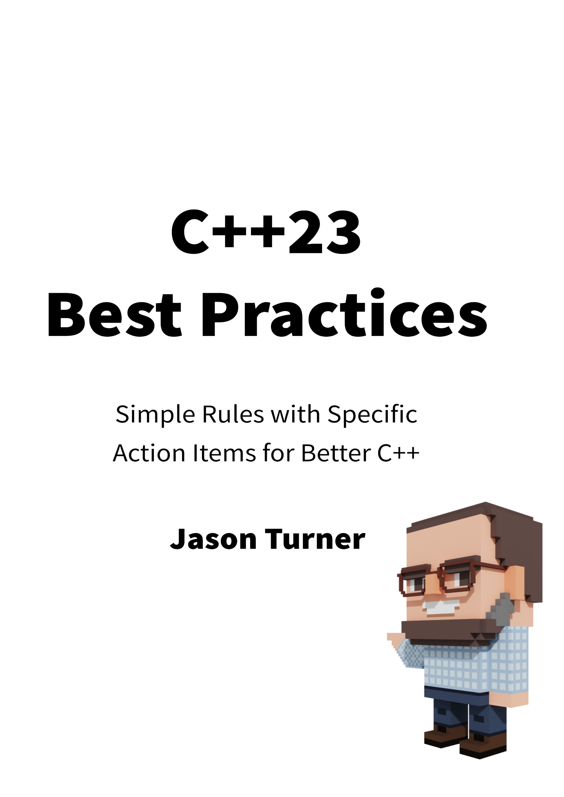

# C++23 最佳实践

*编写优质 C++ 的规则与具体方式*

* 作者：Jason Truner
* 译者：陈晓伟
* 版本: 2024年1月1日

> [!IMPORTANT]
> 翻译是译者用自己的思想，换一种语言，对原作者想法的重新阐释。鉴于我的学识所限，误解和错译在所难免。如果你能买到本书的原版，且有能力阅读英文，请直接去读原文。因为与之相较，我的译文可能根本不值得一读。
>
> — 云风，程序员修炼之道第2版译者

## 本书概述

有史以来第一次，C++23 改变了 C++ 中的“Hello World”。这将为你的代码带来哪些根本性的变化？

**关于本书**

> 引用自 https://leanpub.com/cpp23_best_practices

这是对我《C++最佳实践》一书的重大更新和重新组织。旧版本的内容止步于C++20，而本书已全面更新至C++23，并对所有示例进行了审阅和升级。

如果你仍在使用C++20，建议考虑购买本书的旧版本。而如果计划使用C++23，那么这本书正是为你准备的！

重要提示：在本书编写之时，尚不存在能够编译书中所有示例代码的完整C++23编译器。本书所基于的是我们期望不久后就能拥有的“理论上的C++23编译器”！

作为一名拥有二十多年经验的C++开发者和培训师，我深知各个经验水平的C++开发者常犯的许多共通错误。本书将这些经验凝练成最重要、最需要关注的要点，将你的代码变得更高效、更易于维护且更具可移植性。

大多数章节都包含一个或多个练习，帮助你将所学内容切实应用到当前正在开发的代码中。

本书刻意保持简洁！每个条目都只有简短的篇幅！我会用最少的文字传达核心观点，尽可能让各位读者能快速理解，并立即应用到自己的代码中。

如果你一直关注我并看过我所有的演讲，那么本书中的内容对你来说可能不会有太多新信息。那你为何还要购买呢？本书将最重要的要点进行了系统整合，并提供了练习题，帮助你将这些规则真正落实到代码实践中。

## 作者简介

Jason 使用和教授 C++ 已有二十多年。他是 [C++Weekly]https://www.youtube.com/c/JasonTurner-lefticus)的主持人，也是众多 C++ 项目的作者，这些项目旨在帮助他人学习和探索 C++(https://github.com/lefticus/)。

## 本书相关

* Github翻译地址：https://github.com/xiaoweiChen/Cpp23-Best-Practices

> [!NOTE]
> 译版在Release中提供生成好的PDF文件以供下载，若需要其他格式请自行安装第三方工具(比如：Calibre)进行转换

> [!TIP]
> 译文的LaTeX 环境配置：https://www.cnblogs.com/1625--H/p/11524968.html
>
>  * 禁用拼写检查：https://blog.csdn.net/weixin_39278265/article/details/87931348
>
>  * 使用xelatex编译时需要添加`-shell-escape`和`-8bit`选项，例如：
>
>    `xelatex -synctex=1 -interaction=nonstopmode -shell-escape -8bit "book".tex`
>
>  * 为了内容中表格和目录索引能正常生成，至少需要连续编译两次
>
>  * Latex中的中文字体([思源宋体](https://github.com/notofonts/noto-cjk/releases))和英文字体([Hack](https://github.com/source-foundry/Hack-windows-installer/releases/tag/v1.6.0))，需要安装后自行配置。如何配置请参考主book/css.tex顶部关于字体的信息。
>
> vscode中配置LaTeX：https://blog.csdn.net/Ruins_LEE/article/details/123555016
